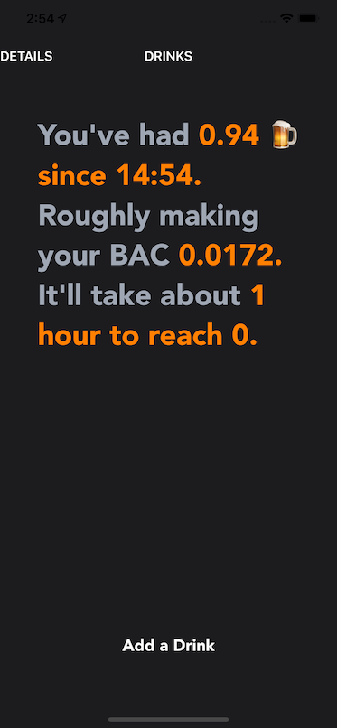
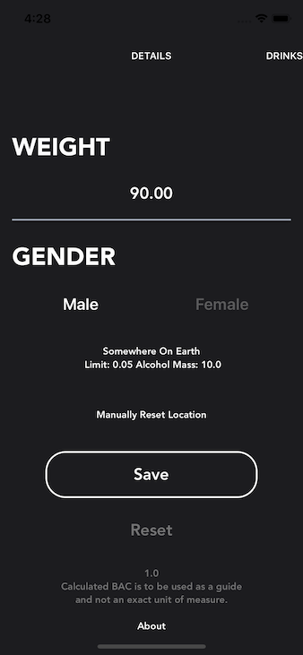
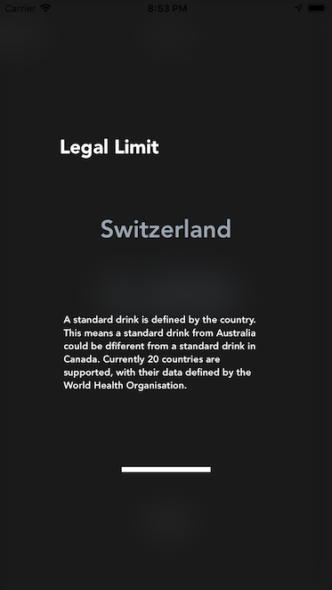
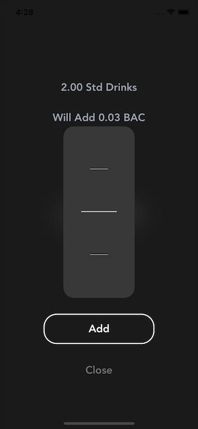

# SimpleBAC (iOS)

Although there are many Bloody Alcohol Trackers out on the app store (this got rejected) I made this to introduce a different kind of interface and reduce the amount of user input required to give a decent estimate of a regular peron's BAC according to World Health Organisation's data for a Standard Drink. This app is based on the Widmark formula, the same formula I used to build a web prototype and app available through my website at https://www.whizbangapps.com/projects.

## Current Features

- Geolocation with World Health Organisation's Standard Drink JSON data.
- Calculates remaining BAC
- Data presented in a clear manner

## Structure

One main View Controller emcompasses a two cell UICollectionView, with each cell for it's own purpose. Similar to SnapChat's full screen swipable interface to switch between the camera, contacts and news. Actually that was the inspiration for SimpleBAC's layout; a quick side note there was a third screen to show world wide accumulated drinks for the day but it's not likely this app will see the light of the app store.

Left most cell contains the user settings. Stored in CoreData, though could have used UserDefaults. The user only needed to enter two personal details about themselves to be able to begin using the app and tracking their BAC.

Right cell stores the user real time data. Containing a clock, estimated BAC, total BAC and time remaining. At the bottom, we can add a drink to keep update our drink total.

There's also a tutorial at the beginning of the app once it's been installed for the first time. It has a very similar setup, using a UICollectionView to walkthrough the main features of the app.

## To do

Code needs a lot of cleaning up - mainly separation of concerns and documentation.